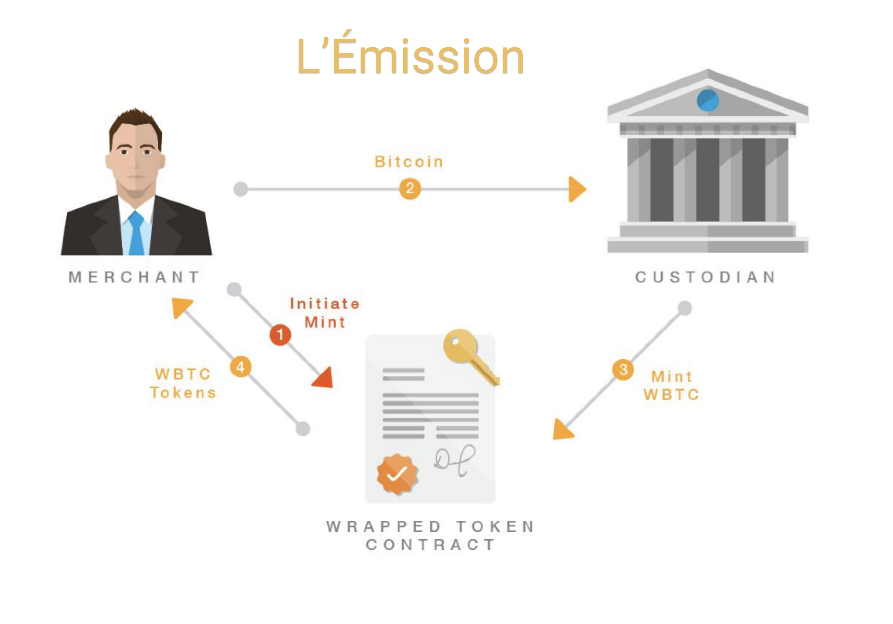
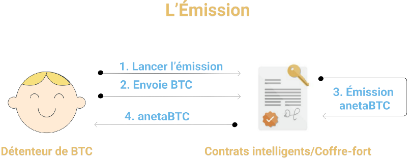

Vous trouverez ci-dessous l’implémentation wBTC actuelle contrôlée par le dépositaire BitGo. Ces diagrammes sont référencés à partir du livre blanc original de wBTC, qui a été développé par nos partenaires, Kyber Network. 

<!-- insert image here -->

Diagramme de protocole wBTC montrant le processus de frappe et de gravure des jetons avec un dépositaire.

Étape finale de wBTC atteignant le client final.

Pour le protocole wBTC, la frappe de BTC ou la confirmation de la gravure des jetons est sous le contrôle total du dépositaire, qui dans ce cas, est BitGo. Ils sont seuls responsables de la surveillance du Bitcoin verrouillé.

Comme indiqué dans le diagramme en haut à gauche, le commerçant doit envoyer son Bitcoin directement au dépositaire. Le dépositaire frappe ensuite le wBTC après avoir reçu le Bitcoin de l’utilisateur et le wBTC correspondant sera envoyé à l’utilisateur.

Pour brûler des jetons, le dépositaire renvoie le Bitcoin d’origine à l’utilisateur et le contrat effectue la gravure de wBTC, et est confirmé et finalisé par le dépositaire.

Comme vous pouvez le voir, le dépositaire a le contrôle total du Bitcoin de l’utilisateur.

Dans le cas d’anetaBTC, Bitcoin est envoyé à un coffre-fort non dépositaire qui stocke en toute sécurité le Bitcoin via des contrats intelligents.

Vous trouverez ci-dessous la mise en œuvre d’anetaBTC qui est facilitée par des contrats intelligents non interactifs.

Diagramme de protocole anetaBTC de frappe d’anetaBTC et de verrouillage de BTC à l’aide de contrats intelligents Ergo non déposidiques et non interactifs.

Dans le cas d’anetaBTC, au lieu que les utilisateurs envoient Bitcoin à un dépositaire, il est envoyé à un coffre-fort qui est un contrat intelligent qui stocke le Bitcoin, frappe anetaBTC, puis envoie l’anetaBTC au portefeuille connecté.

Pour échanger BTC, les utilisateurs initient simplement l’échange et renvoient leur anetaBTC au coffre-fort et le contrat intelligent libérera le Bitcoin à l’utilisateur lorsqu’il confirmera avec succès la réception d’anetaBTC.

L’utilisateur demandera à émettre ou à utiliser anetaBTC et la base de données anetaBTC relaiera la fonction que l’utilisateur essaie d’exécuter et enverra cette demande au pont anetaBTC. De là, le pont anetaBTC enverra ces informations à anetaBTC-stats où les événements seront écrits dans la base de données officielle des événements anetaBTC et reliront les informations à anetaBTC-stats.

Le diagramme montre également que lorsque l’utilisateur effectue la demande initiale, les données sont également envoyées du tableau de bord à anetaBTC-stats, puis confirmées ultérieurement avec des informations sur les événements.

De plus, il existe une chaîne de relais connectée à la blockchain Bitcoin qui communique avec le pont anetaBTC. La chaîne de relais envoie le Bitcoin de l’utilisateur au pont anetaBTC qui dispose d’un portefeuille Bitcoin incorporé où les actifs de l’utilisateur sont détenus.

Le pont anetaBTC communique également avec le nœud Ergo et relaie les informations directement à la blockchain Ergo. Pendant ce temps, le pont anetaBTC exécutera l’émission ou utilisera l’actif souhaité et enverra le jeton à l’utilisateur directement à partir du coffre-fort. Pour émettre BTC, l’utilisateur devra payer un dépôt de garantie en ERG, d’où la raison pour laquelle le coffre-fort envoie des garanties ERG verrouillées au pont anetaBTC. Il s’agit d’une mesure de sécurité visant à encourager une activité réelle et à prévenir le chagrin des coffres-forts. Le dépôt de garantie ERG sera remis à l’utilisateur pour les transactions terminées.

Si le détenteur de Bitcoin n’envoie pas avec succès le BTC au coffre-fort à temps, le coffre-fort peut annuler la demande d’émission et recevoir la garantie ERG de l’utilisateur.
