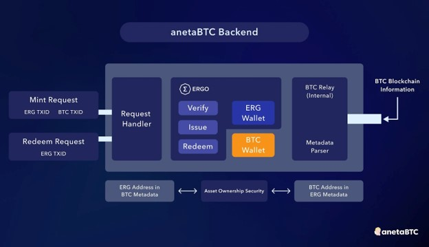

# V1 Technical Architecture

Our technical architecture is designed to prioritize security while also providing an enjoyable user experience when minting and redeeming eBTC.

We believe our implementation is secure as it allows for verifiable and transparent proof of mint and redeem requests on both the Bitcoin and Ergo blockchains.

This is achieved by utilizing metadata to accurately verify the addresses that should receive eBTC or BTC.

Our implementation is based on years of research from the Interlay protocol on Polkadot, as well as research from the Rosen bridge, and our own solution, Mazi, a decentralized, cross-chain address association mechanism for Cardano and Ergo.

Below is a visual breakdown of how the protocol works on a technical level.

  
anetaBTC Backend Technical Diagram

Our full V1 technical architecture can be found in our article [here](https://medium.com/@anetaBTC/technical-architecture-and-security-assumptions-3b24edfec871). 
